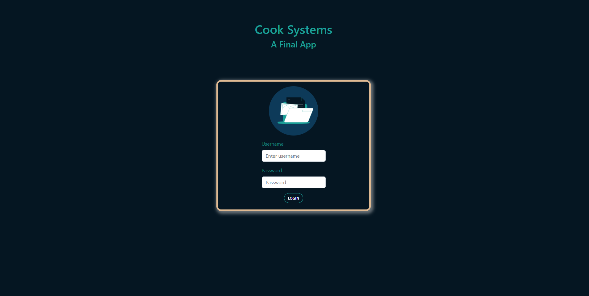
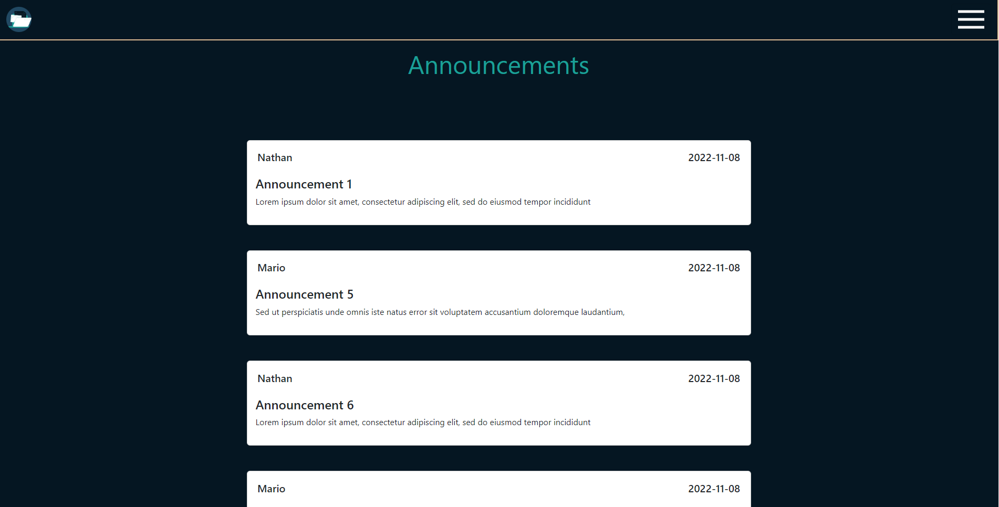
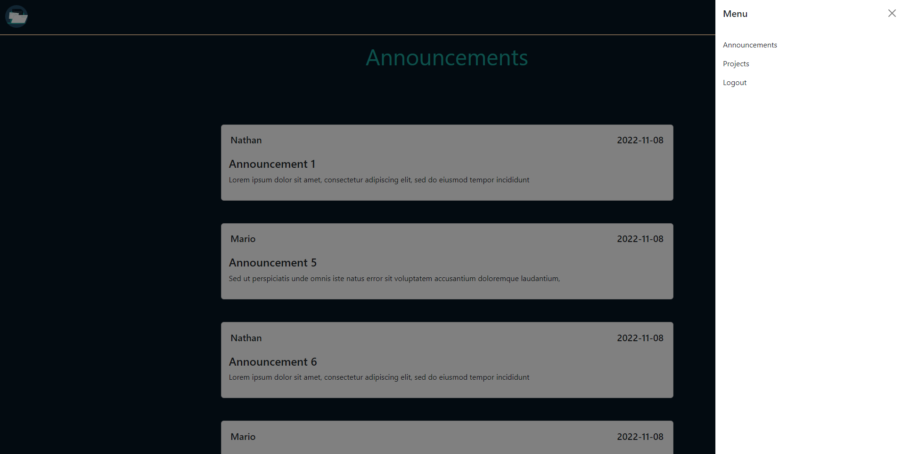
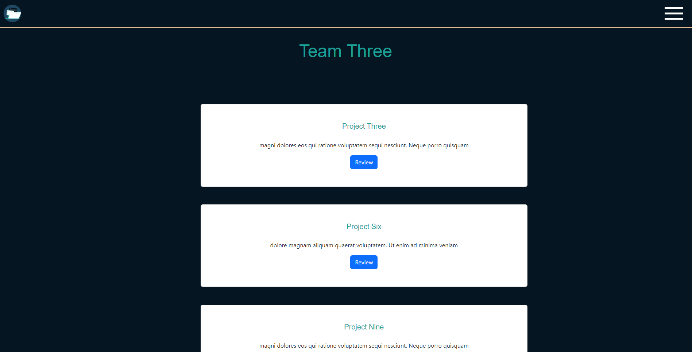
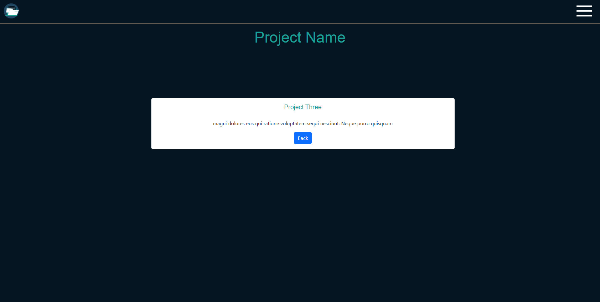

# Project Management Applicaton 
This is a full-stack application that allows users to sign in and view the announcements for the company they work for as well as the projects specific to the team they are a part of. The company and team information is stored in the backend data-base and endpoints allow the projects to be accessed by the users team data and the announcements to accessed by the users company data. 

Project Prompt:

## Technology

- Built with React.js, JSX, HTML, CSS, Expressjs, Node.js, Git, Java, SpringBoot, JPA, PostgreSQL, PGAdmin, Postman, Eclipse, Maven

## Screenshots 
### Home:

The Homepage has the following features:

- A Sign in page where you can input your username and password and submit to go to the next page.

### Announcements Page:

- The list of announcements specific to the company of the user.

### Side Bar:

- If you click on the hamburger on the top right corner it will deploy the side navigation menu.

### Projects Page:

- The user can access the specific projects that are assigned to their team.
- If the user clicks on the Review button they can access the more detailed view of that particular project.

### Project Page:

- The user can view the more detailed verson of the project they've clicked on.
- The back button returns them to the projects page.

---

## ERD

